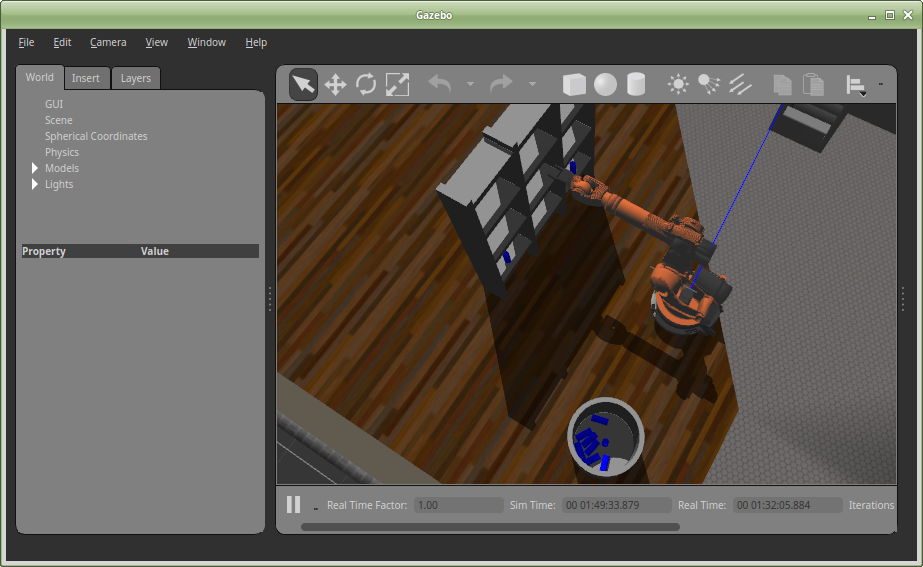
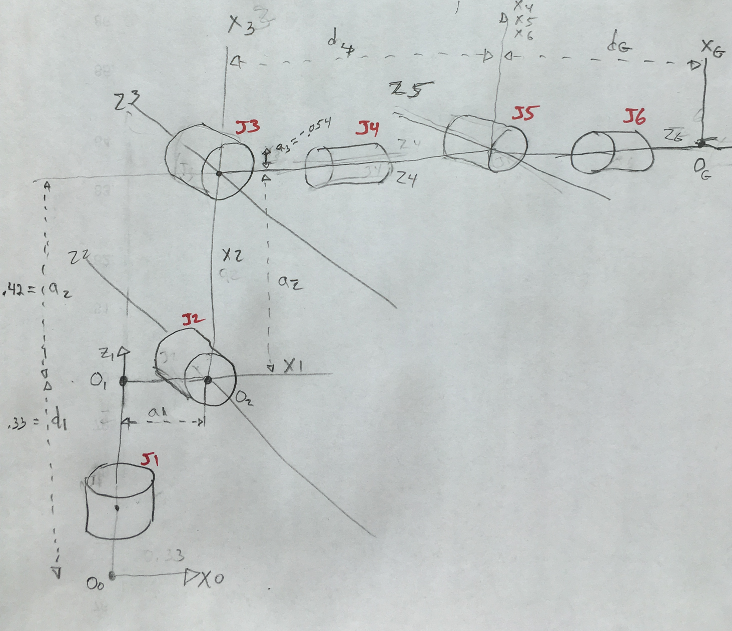
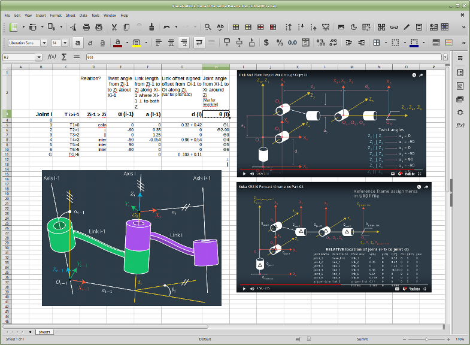

## RoboticsND Project: ROS Kinematics Pick & Place
### Submission writeup: ChrisL


Yay!


#### Intro
I had hoped to make the robot safely juggle kittens but it's been
an ardous project and I've achieved basic functionality.
The wrist is still erratic sometimes erratic.
Setting up my environment was an odyssey in itself. See Enviro-Odyssey below.

### Kinematic Analysis
The forward kinematics was not too difficult. Trying all the steps at once for a complicated robot
such as the KR210 was time consuming.  (See Udacity Suggestions below).
I managed to get working values eventually.
The wrist corrections especially are difficult and may be the reason for
my errant wrist behaviour. I suspect that the square roots used imply multiple
solutions that whose 'selected' orientations vary from one pose to the next.


#### Forward_kinematics and DH parameters.

The various tutorial schematics of the arm DH coordinate systems were essential..<br/>
I used those images to draw my own <br/>




and on a spreadsheet<br/>
<br/>
[PlaceAndPick_DenavitHartenberParams.xlsx](./PlaceAndPick_DenavitHartenberParams.xlsx)


where I accumulated my DH parameters.

#### Creating link transforms from DH parameters
This was straightforward enough. I created a function that implements the generalized 
DH parameter transform

    transform = Matrix(
        [[  cos(theta),                 -sin(theta),            0,            a],
         [  sin(theta)*cos(alpha),      cos(theta)*cos(alpha),  -sin(alpha),  -sin(alpha)*d],
         [  sin(theta)*sin(alpha),      cos(theta)*sin(alpha),  cos(alpha),   cos(alpha)*d],
         [  0,                          0,                      0,            1]])

    transform = transform.subs(dictSymbols)

and and used that to create transforms for each joint. For example

    T0_1 = CreateDHTransform(alpha0, a0, d1, theta1 )

and created the composite transform T0_G by multiplying each TFi+1 in sequence

    g_tf.T0_G  = g_tf.T0_1 * g_tf.T1_2 * g_tf.T2_3 * g_tf.T3_4 * g_tf.T4_5 * g_tf.T5_6 * g_tf.T6_G
    T0_GFinal = T0_G * tfGripperOrientFix
The final step is the YZ gripper orientation fix suggested in the tutorial.

I then ran the code in a Jupyter notebook (it's a faster debug cycle) for various
joint angles like this:

    dictTestAngles = {theta1: 1, theta2: 0, theta3: 0, theta4: 0, theta5: 0, theta6: 0, }
    print("T0_Gfinal = ", T0_GFinal.evalf(dictTestAngles))

I used RQT to set various joint angles and RVIZ to observe 
the final position of the gripper to ensure that the results 
returned by my forward kinematics were in agreement. 
This is a pretty flimsy test plan, sure, 
but it helped me get my transforms to a point of some confidence. 
Clearly a more thorough, robust testing mechanism must exist for this.

#### Reverse Kinematics
This was substatially more difficult but made somewhat simpler by the
fact that problem can be separated into solving 2 problems:
the wrist location and the gripper orientation.
The wrist location can be calculated as a simple offset from
the requested gripper pose position, 
regardless of the requested orientation. This first three joint
angles can be calculated with some trigonometry.


Those values can then be used to find an exact T0_3. 
Then R3_6 can be found from T0_3.inv() * R0_6
Using R3_6, which has as variables Joint angles 4-6,
and some opaque (to me) trigonomtery the final joint angles can
be computed.


### Project Implementation

The entire solution resides in the python script IK_server.py 
which is launched with ```rosrun kuka_arm IK_server.py```
The core function is ```IKCalculateJointAnglesFromPose(poseReq, tfs, dh, dictDHVals):```
which calulates the joint angles for a single pose following the proscribed
reverse kinematics described in the walkthrough.


**NOTE**
The submitted IK_server.py is not the most recent. It is very messy but
it basically works. The most recent is IK_serverCleanedBroken.py. 
I had attempted to cleanup and refactor the code quite a bit. Unfortunately
something got broken and I am needing to move on. I would love assistance
in finding the problem in that version.

I also split up the server code into intemediate functions
* ```Server Init()```
Creates the ROS IK_server node and registers the calculate_ik service
and routes it to
* ```cbServiceRequestHandler()```
This handler has some exception handling code and merely passes the
request to
* ```ProcessMain(request)```
This loops over the poses in the request and packages and assemble the 
joint angles returned by
* ```IKCalculateJointAnglesFromPose()```
This is where the actual calculations are performed.

The reason for this is that I wanted to be able to send custom poses directly
to from a Jupyter notebook: RosKinDebug.ipybn
directly to IKCalculateJointAnglesFromPose()
as well as to separate the various concerns.
The notebook permitted me to create tables of output and analysis.

I moved calculation of common transforms and paramaters
out of the main loop into one time init code. This was to keep the main
loop clear of debris and because the transform calculations
can take alot of time. I created a save to file mechanism until
I realized that simplify(transform) wasn't needed in practice.

Additionally I created IK_utils.py that has many object conversions
and print functions used in the dev debug notebook

### Enviro-Odyssey
**tldr:** It took me a long time to get a working environment.<br/>
I prefer Mint linux to Ubuntu and already had a Mint18 VM. 
Getting the ROS environment to match the provided Ubuntu VM was a chore, since 
Mint is not explicitly supported by ROS. I expect I'll have more problems later.
If fact just getting the Ubuntu VM to run was a chore because 
I had an older version of VMWare player that failed without providing any clue 
(This should be a App Note in the course instructions)
Additionaly as much as possible I wish to run natively on my Laptop, 
not in a VM, especially because my laptop has a capable NVidia chip that is difficult to make use of via VM.

Unfortunately I was only able to purchase the Laptop with Windows10, 
which I need to keep for various reasons. So I had to create a dual boot system. 
But the SSD was already completely full, 
so first I had to clone the windows drive to a new bigger SSD to make room for Mint.
Moving my Mint18 VM image directly seemed daunting and conducive to errors, 
so instead I installed Mint18 and copied most of my home folder over from the VM.
Then I had trouble getting the (proprietary) NVidia drivers installed. 
Then finally getting to ROS tools working was more difficult that it would be otherwise because 
the error messages are not abuntantly clear and 
I usually assumed it was due to my custom enviroment rather than
some typo or misstep in setup (eg opening a second console and missing one of the `source` steps.)

Additionally I wanted to clone/enable the Rover project 
on the new Mint system (I had done it in Win10) so
I needed to install conda and jupyter and the Rover conda environment.

Finally, since I am finding that I am using a variety of linux systems and 
expecting that I will need use Udacity-AWS VMs soon I've spent much time 
customizing my linux environment (bashrc & emacs and more) and creating
a mechanism for quickly cloning that environment to other systems.


### Udacity Suggestions
* Break up this unit into more digestiable chunks.
A much simpler robot first, to get used to the ROS env and runtime tools 
and to outline a debugging strategy, which was never really supplied 
and was made difficult by the structure of walkthrough solution such as 
a monolithic function reliance and confusing identifier names. 
If anybody actually reads this and would like detailed feedback
regarding improvements to could be made to this module feel free to ask and I 
will assemble some notes.


### Links
[Rubric](https://review.udacity.com/#!/rubrics/972/view) 

